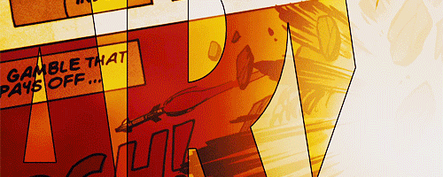

### AML Software & Other

-----

  

<h1 align="center">Just a big fan of comics</h1>

<!-- Marvel (Comics) -->

  
  
  

<!-- DC Comics -->

  
  
  

<!-- Profile views -->

  

-----
### :hammer_and_wrench: Languages and Tools :
-----

    &nbsp;
  &nbsp;
  &nbsp;
  &nbsp;
  &nbsp;
  &nbsp;
  &nbsp;
  &nbsp;
  &nbsp;
  &nbsp;
 

<!--
**po79tvx/po79tvx** is a ✨ _special_ ✨ repository because its `README.md` (this file) appears on your GitHub profile.

Here are some ideas to get you started:

- 🔭 I’m currently working on ...
- 🌱 I’m currently learning ...
- 👯 I’m looking to collaborate on ...
- 🤔 I’m looking for help with ...
- 💬 Ask me about ...
- 📫 How to reach me: ...
- 😄 Pronouns: ...
- ⚡ Fun fact: ...
-->
